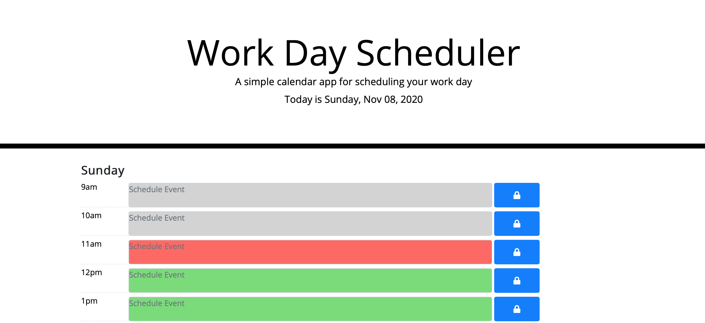

# Work-Day-Scheduler-Application

UW Code Bootcamp Week 5 HW

## Table of Contents

- [Developer Comment](#developer-comment)
- [Employer Request](#employer-request)
- [User Story](#user-story)
- [Acceptance Criteria](#acceptance-criteria)
- [Mockup](#mockup)
- [Website Features and Highlights](#website-features-and-highlights)
- [Live Project Site](#live-project-site)
- [Installation and Git Repository](#installation-and-git-repository)
- [Credits](#credits)

## Developer Comment

Hello everyone, and welcome back to my Repo! My name is Abdulhakeem Dahir and I am an aspiring Software Developer. This week I have been tasked to make a Work Day Scheduler Application. This was not an easy assignment as you need to convert your knowledge of Javascript into jQuery. Any feedback is welcome! Thank you!

## Employer Request

An employee wants an application that will allow them to plan their work day accordingly. The user wants to be able to manually add their own events and to save them. Below is their User Story:

### User Story

```
AS AN employee with a busy schedule
I WANT to add important events to a daily planner
SO THAT I can manage my time effectively
```

### Acceptance Criteria

```
GIVEN I am using a daily planner to create a schedule
WHEN I open the planner
THEN the current day is displayed at the top of the calendar
WHEN I scroll down
THEN I am presented with timeblocks for standard business hours
WHEN I view the timeblocks for that day
THEN each timeblock is color coded to indicate whether it is in the past, present, or future
WHEN I click into a timeblock
THEN I can enter an event
WHEN I click the save button for that timeblock
THEN the text for that event is saved in local storage
WHEN I refresh the page
THEN the saved events persist
```

## Mockup

The following animation demonstrates the application functionality:


## Website Features and Highlights

The follwing are all of the feautres and highlights of my portfolio:

### HTML & CSS

```
- Created a responsive HTML shell for my code to run
- Created the necessary structure for the Daily Planner
- Used Bootstrap to create the layout and design of the Application
- Used Flex Box and Column widths to make responsive on all devices
```

### JAVASCRIPT

```
- Set up date and time variables with Moment JS
- Used my setup Data Attrubutes as Conditionals
- Added the feature to know whether you are past, present or future in your Daily Entry area.
- Stored all values when save button is pressed to Local Storage.
- User can see their notes even when they refresh.

```

## Live Project Site

https://abdulhakeemdahir.github.io/Work-Day-Scheduler-Application/



## Installation and Git Repository

Respository: https://github.com/abdulhakeemdahir/Work-Day-Scheduler-Application

Please follow the installation process below:

```
1. Fork the repository from the link above
2. Clone the repo to your computer via git
3. Open the project files with the text editor of your choice.
```
